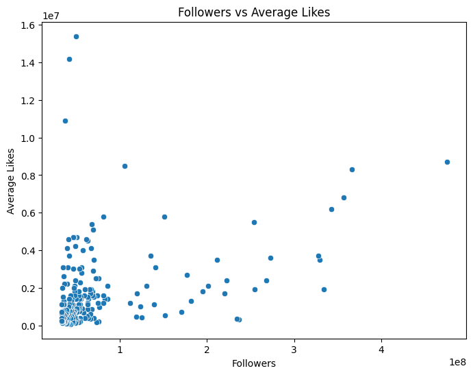
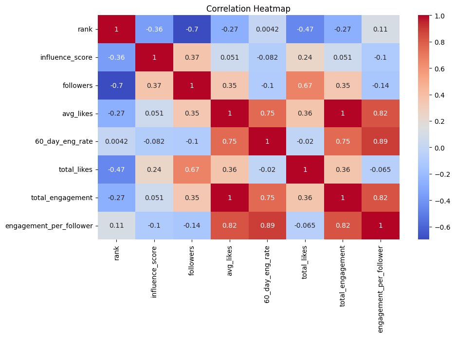
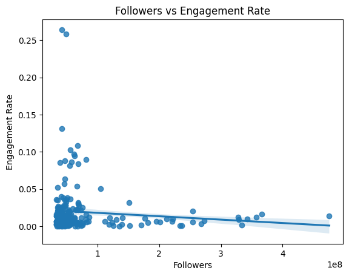
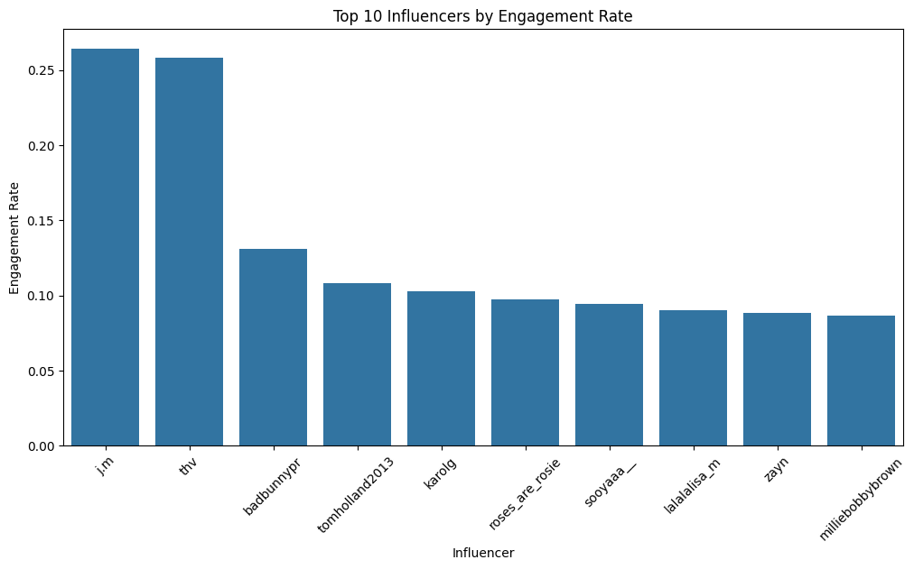
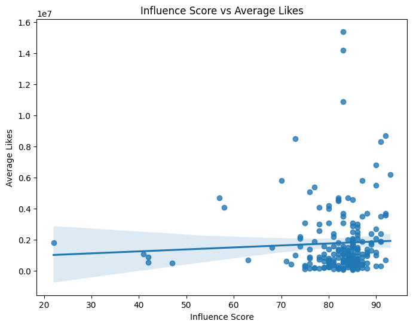
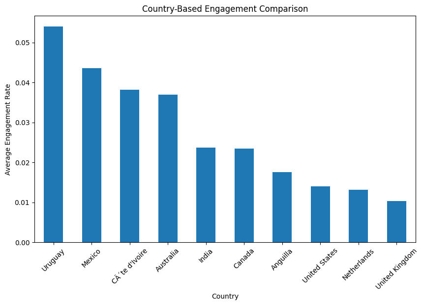
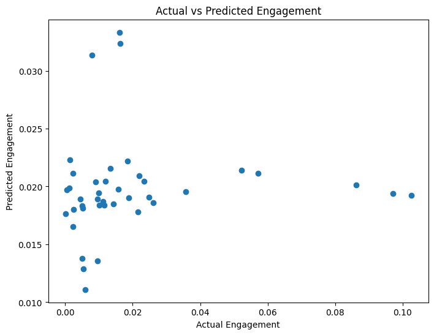
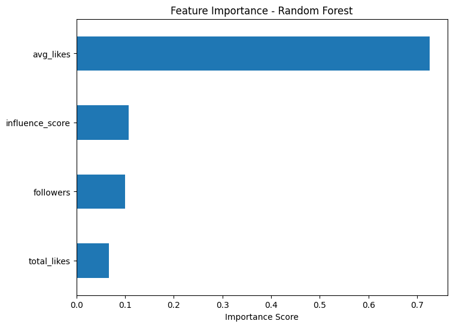

# DSA210 Term Project: Analyzing Instagram Influencer Engagement
## Table of Contents

1. Motivation
2. Research Questions and Hypotheses
3. Data Source and Collection
4. Data Description
5. Methodology
6. Figures and Visualizations
7. Machine Learning Validation
8. Coefficient Analysis
9. Conclusion
10. Limitations and Future Work
11. AI Usage and Academic Integrity

## Project Overview

## Repository Structure

```text

DSA210-sila-ozturkler/
│
├── data/
│   └── dataset.csv
│
├── figures/
│   ├── actual_vs_predicted.png
│   ├── country_engagement.png
│   ├── feature_importance.png
│   ├── followers_vs_engagement.png
│   ├── followers_vs_likes.png
│   ├── heatmap.png
│   ├── influence_score_vs_likes.png
│   └── top_engagement.png
│
├── notebooks/
│   ├── 01_data_analysis.ipynb
│   └── 02_machine_learning.ipynb
│
├── reports/
│   └── dsa210proposalnew.pdf
│
├── README.md
└── requirements.txt

```

This project investigates Instagram influencer engagement patterns using exploratory data analysis, visualization techniques, and machine learning models.

The analysis focuses on identifying how variables such as followers, average likes, influence score, and audience engagement interact with each other.

Using Python-based data science libraries, the project combines statistical analysis with predictive modeling to better understand influencer performance on social media platforms.

## 1. Motivation
Social media platforms have become one of the most important environments for digital marketing and audience interaction. Instagram influencers affect consumer behavior, brand visibility, and online communication through engagement metrics such as likes, comments, and follower interaction.

This project aims to analyze the factors that influence Instagram engagement using data science and machine learning techniques. By examining relationships between follower count, influence score, likes, and audience interaction, the study seeks to better understand how influencer popularity and engagement behavior are connected.

The project also demonstrates how statistical analysis and predictive modeling can be applied to real-world social media datasets.

## 2. Research Questions and Hypotheses
### Main Research Question

How do follower count, engagement rate, posting activity, and audience interaction affect influencer popularity on Instagram?

---
### Sub-Questions

- Do influencers with more followers always receive higher average likes?
- Is engagement rate strongly related to influence score?
- Does posting activity increase audience interaction?
- Are there observable engagement differences between influencers from different countries?
- Can machine learning models predict influencer engagement using Instagram metrics?
---

### Hypotheses

H1: Influencers with higher follower counts tend to receive higher average likes.

H2: Higher engagement rates are associated with higher influence scores.

H3: Posting activity positively affects total engagement.

H4: Engagement per follower differs among influencers from different countries.

H5: Follower count alone is not sufficient to explain engagement rate.

H0 (Null Hypothesis): Instagram engagement metrics do not have a statistically significant relationship with influencer popularity.

## 3. Data Source and Collection
The dataset used in this project contains Instagram influencer statistics collected from publicly available social media data sources.

The dataset includes numerical and categorical variables related to influencer popularity, engagement, and audience interaction.

Main variables used in the analysis:

- follower count
- average likes
- engagement rate
- total likes
- number of posts
- influence score
- country

During preprocessing, numerical abbreviations such as "k", "m", and "b" were converted into numerical values.

Percentage columns were cleaned and transformed into float variables for statistical analysis and machine learning implementation.

Missing values and duplicated rows were removed before analysis.

## 4. Data Description

| Variable | Description | Purpose |
|---|---|---|
| Followers | Total follower count of the influencer | Measures popularity |
| Average Likes | Average number of likes per post | Measures audience interaction |
| Engagement Rate | Percentage of audience engagement | Main engagement metric |
| Total Likes | Total number of likes received | Measures total interaction |
| Posts | Number of posts shared by the influencer | Measures posting activity |
| Influence Score | Overall influencer popularity score | Used to analyze influencer performance |
| Country | Country information of the influencer | Used for country-based comparison |


## Dataset Description

The dataset contains Instagram influencer statistics collected from publicly available sources.

The dataset includes both numerical and categorical variables related to:
- popularity
- audience interaction
- engagement behavior
- influence performance

Python libraries such as Pandas, NumPy, Matplotlib, Seaborn, and Scikit-learn were used throughout the analysis process.

## 5. Methodology
This project combines exploratory data analysis, statistical analysis, hypothesis testing, and machine learning techniques.

### Statistical Analysis

The following statistical methods were used:

- correlation analysis
- scatter plots
- log-log visualizations
- country-based comparisons
- engagement distribution analysis

The relationships between followers, likes, engagement rate, and influence score were examined using visualizations and correlation analysis.

Log-log plots were additionally used because influencer datasets contain extreme outliers with very large follower counts.

### Machine Learning

Machine learning models were implemented to predict influencer engagement and popularity using Instagram metrics.

The following features were used in the machine learning models:

- followers
- average likes
- engagement rate
- total likes
- posts

The dataset was divided into training and testing sets.

The following machine learning approaches were applied:

- Linear Regression
- Random Forest Regression

Performance evaluation metrics:

- R² Score
- Mean Absolute Error (MAE)

Feature importance analysis was also performed to determine which variables contribute most to influencer engagement prediction.

## 6. Figures and Visualizations

This section presents the visualizations used to explore relationships between Instagram influencer engagement metrics and machine learning results.


### Followers vs Average Likes


This scatter plot shows the relationship between follower count and average likes.

Key observations:

- There is a moderate positive relationship between followers and average likes.
- Influencers with more followers generally receive more likes.
- However, the relationship is not perfectly linear because engagement also depends on content quality and audience interaction.


### Correlation Heatmap



This heatmap visualizes the relationships between Instagram engagement variables.

Key observations:

- Average likes and engagement rate show a strong positive correlation.
- Follower count has a moderate relationship with total likes.
- Engagement per follower is strongly associated with engagement rate.
- Some variables show weak or negative correlations.

### Followers vs Engagement Rate



This graph illustrates the relationship between follower count and engagement rate.

Key observations:

- Influencers with very large audiences may have lower engagement rates.
- Smaller influencers sometimes achieve stronger audience interaction.
- Follower count alone does not determine engagement quality.

### Top 10 Influencers by Engagement Rate



This chart shows the influencers with the highest engagement rates.

Key observations:

- Some influencers achieve very high engagement despite having fewer followers.
- Engagement rate varies significantly across influencers.
- Audience interaction is not determined only by follower count.

  
### Influence Score vs Average Likes



This graph shows the relationship between influence score and average likes.

Key observations:

- Influencers with higher influence scores generally receive more average likes.
- There is a positive relationship between influence score and audience interaction.
- Engagement is also affected by content quality and audience behavior.

  
### Country-Based Engagement Comparison


This graph compares average engagement rates across countries.

Key observations:

- Some countries show significantly higher engagement rates.
- Audience behavior differs across geographic regions.
- Country demographics may influence interaction patterns.

### Actual vs Predicted Engagement


This graph compares actual engagement values with machine learning predictions.

Key observations:

- The model captures general engagement patterns reasonably well.
- Some prediction errors still exist because engagement depends on many external factors.
- Followers and influence score partially explain engagement behavior.

### Feature Importance – Random Forest


This graph shows which variables contribute most to engagement prediction in the Random Forest model.

Key observations:

- Average likes and total likes are among the strongest predictors.
- Followers and influence score also contribute to engagement prediction.
- Different variables affect engagement at different levels.

## 7. Machine Learning Validation

A Linear Regression model and a Random Forest model were used to predict engagement rates.

The prediction results show that Instagram engagement can be partially explained by variables such as followers, influence score, and average likes.

However, engagement behavior is also influenced by content quality, trends, audience loyalty, and external social factors.

## 8. Coefficient Analysis

Regression analysis suggests that influence score and average likes positively affect engagement rate.

Follower count alone is not always a strong predictor of engagement because smaller influencers may achieve stronger audience interaction.

## 9. Conclusion

This project analyzed Instagram influencer engagement using data science and machine learning techniques.

The findings suggest that:
- Engagement is affected by multiple variables.
- Influence score and audience interaction are important indicators.
- Large follower counts do not always guarantee high engagement.

Machine learning models can help explain influencer performance patterns, although social media behavior remains complex and dynamic.

## 10. Limitations and Future Work

This project has several limitations:
- The dataset may not represent all influencer categories equally.
- Some engagement-related factors are not directly measurable.
- Social media trends constantly change over time.

Future studies could include:
- Sentiment analysis
- Content-based image analysis
- Time-series engagement prediction
- Deep learning models

## 11. AI Usage and Academic Integrity

Artificial Intelligence tools, including ChatGPT, were used to support coding assistance, debugging, and text editing during this project.

All analysis decisions, interpretations, and final outputs were reviewed and organized by the student.

The project follows academic integrity principles and uses AI only as a supportive educational tool.
---
Developed as part of the DSA210 Introduction to Data Science course project.

## Technologies Used

- Python
- Pandas
- NumPy
- Matplotlib
- Seaborn
- Scikit-learn
- Jupyter Notebook
